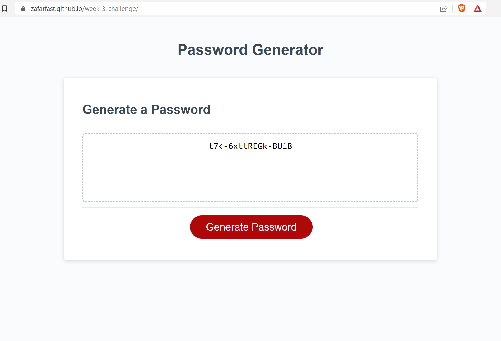

# week-3-challenge

## Random Password generator

### Screenshot

### Acceptence criteria:

- Ask user how about the password length in numbers only.
- Ask user whether they want to include special characters.
- Ask user whether they want to include numeric characters.
- Ask user whether they want to use Lower case characters.
- Ask user whether they want to include upper case characters.
- Show the password to the user in alert box or on the text window.
